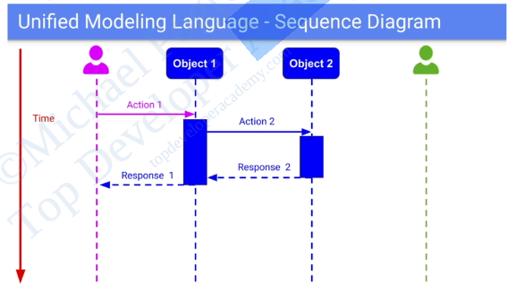

# Introduction to System Requirements and Architectural Drivers

## Introduction to System Requirements and Architectural Drivers

1. Requirements: Formal description of what need to be built
2. Type of Requirements - Architectural Drivers
    - Features of the system
        - Functional requirements
    - Quality attributes of the system
        - Non-functional requirements
           - Examples: Performance, Security, Scalability, etc.
        - Dictate the software architecture of the system
    - System constraints
        - Examples: Budget, Time, Technology, etc.

## Feature Requirements

### Methods of Gathering System Requirements

1. **Use Cases**: Situations and scenarios that the system must handle.
2. **User Flows**: Graphical representations of the steps a user takes to accomplish a task.

### Requirement Gathering Steps

1. Identify all actors/users of the system.
2. Capture and describe all the possible use cases and scenarios.
3. User flow - expand each use case though the flow of the events. Each event contains: Action and Data.

### Sequence Diagram

Sequence diagrams represent interactions between actors and the system, showing the sequence of events and data flow. They help visualize how different components of the system interact over time.

## Feature Requirements - Step by Step Process

### System Quality Attributes Requirements

1. **System Quality Attributes**
    - Provide a quality measure of how well our system performs on a particular dimension
    - Have a direct correlation with the architecture of our system

2. **Important Considerations**
    - Testability and Measurability
    - Trade-offs between different quality attributes
        - No single software architecture can provide all the quality attributes
        - Certain quality attributes contradict each other, e.g., performance vs. security
        - Some combinations of quality attributes are very hard/impossible to achieve

    - Feasibility
        - We need to make sure that the system is capable of delivering what the client is asking for

## System Constraints in Software Architecture

1. Definition: A system constraint is essentially a decision that was already either fully or partially made for us, restricting our degrees of freedom.
2. Types of Constraints
    - Technical constraints
    - Business constraints
        - Forces us to make sacrifices in: architecture and implementation
    - Regulatory/legal constraints
        - Global
        - Specific to a region
3. Considerations
    - We shouldn't take any given constraint lightly
    - Use loosely coupled architecture
